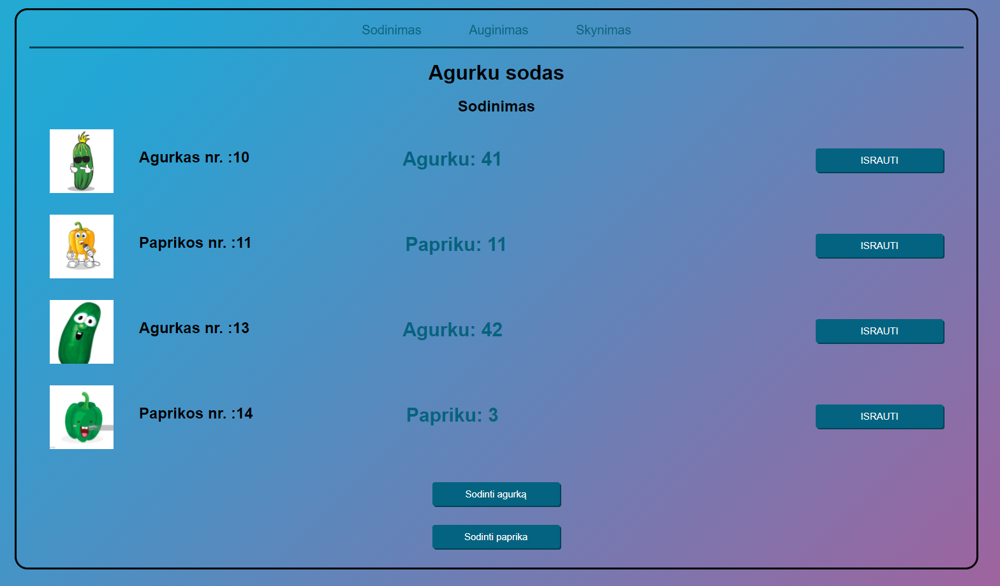

# PHP homework
### Level-beginner

This repository is for educational porpuses only. 

### Tasks include
1. Variables and IF statements (Kintamieji ir sąlygos)
2. Strings (Stringai)
3. Loops (Ciklai)
4. Array part 1 (Masyvai I)
5. Array part 2 (Masyvai II)
6. Functions (Funkcijos)
7. WEB (WEB mechanika)
8. OOP basics (Garden-2)
9. Axios/JS/JSON (Javascript)
10. API (Distance, Foreign Exchange rates)
11. MVC (Garden-2)

### Authors
[Mazvydas](https://github.com/Slashass)